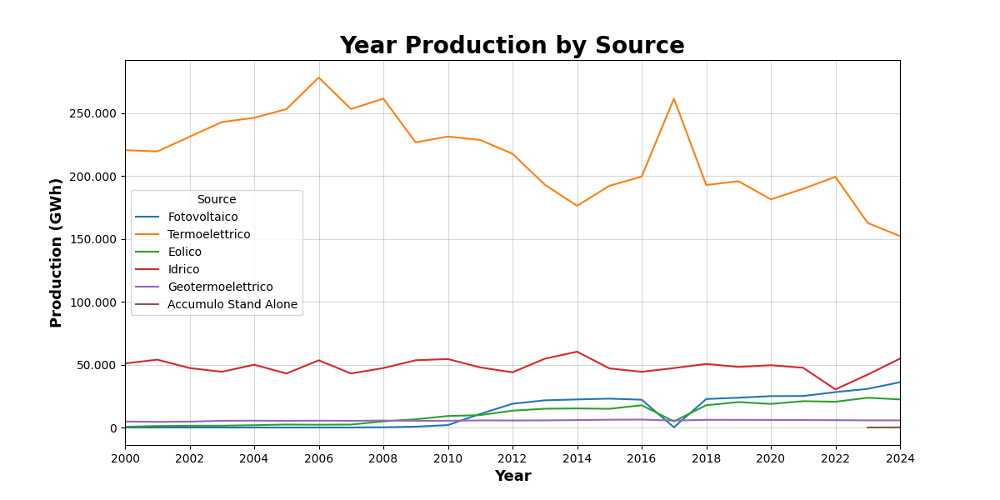
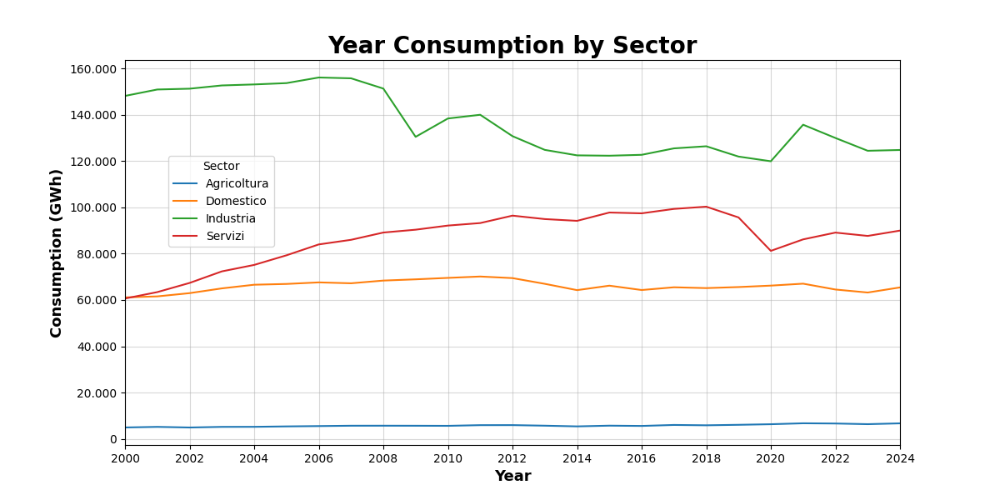
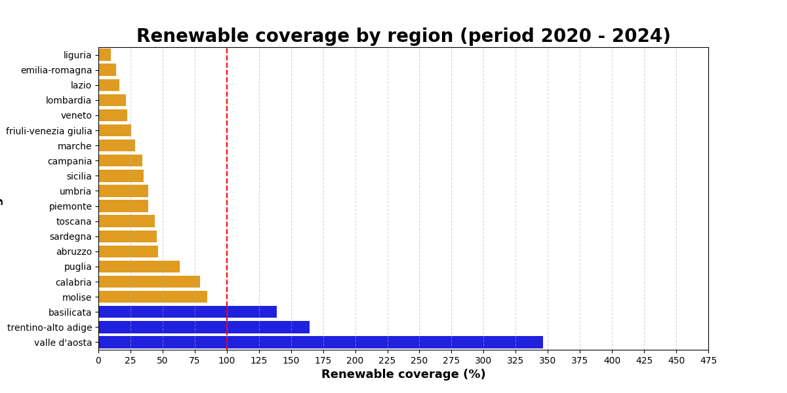
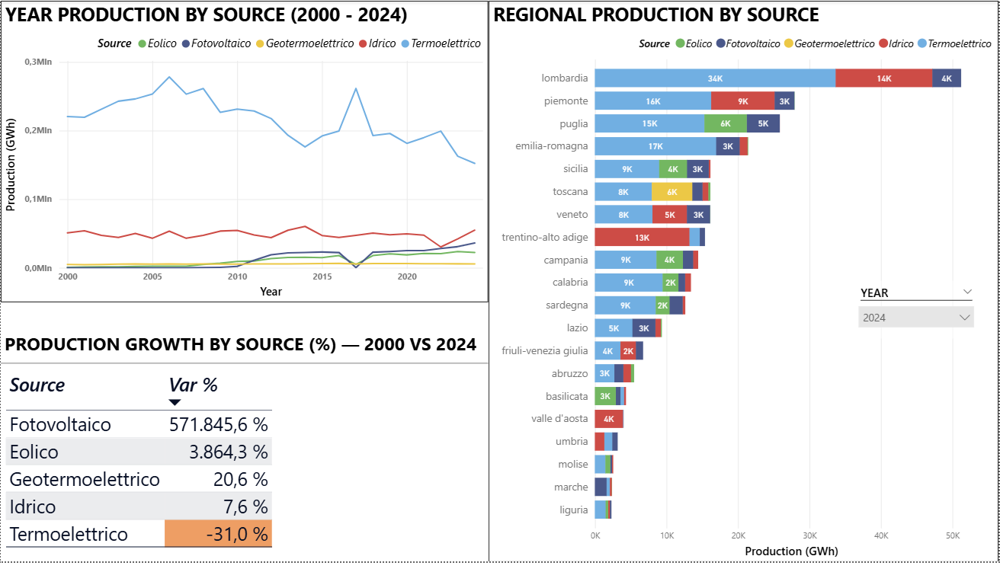
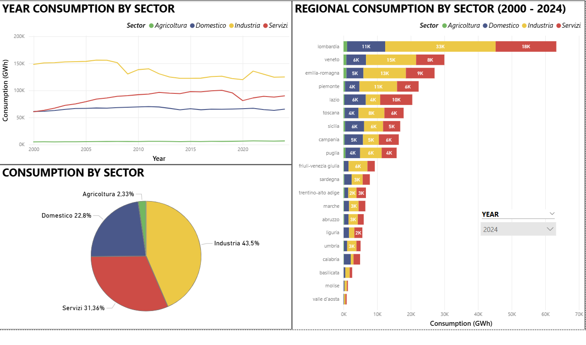
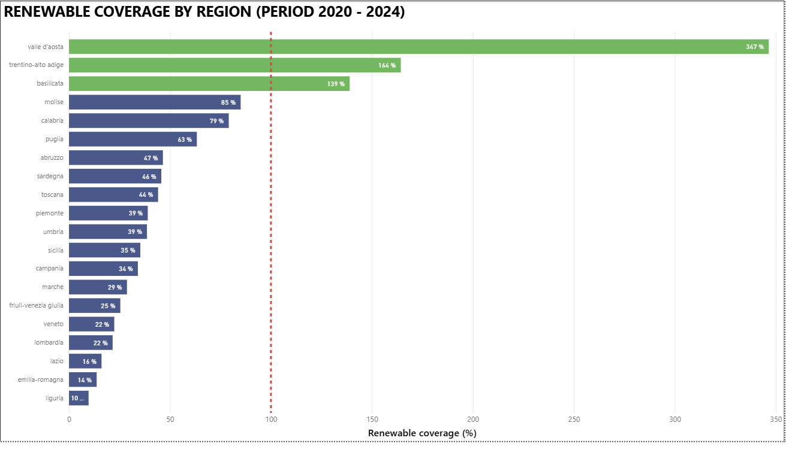

# Italy Energy Analysis

## Overview
The project aims to analyze energy production and consumption of Italy in the last 24 years with a focus on the renewable sources.

## Dataset
Datasets are from **Terna S.p.a.**, the main independent operator of electricity transmission networks in Europe and the main proponent of the ecological transition. Data are from 2000 to 2024.

## Tech Stack
 Python, PostgreSQL, Power BI

## Project Structure
```
Analisi_energia/
├── Consumption/
├── Production/
├── Visuals/   # charts and dashboard screenshots
├── analysis_visualization.ipynb
├── consumption_analysis.ipynb
├── production_analysis.ipynb
├── energy_consumption.csv
├── energy_production.csv
├── energy_dashboard.pbix
├── queries.sql
└── README.md
```
> ⚠️ Create a local `db.env` file with your PostgreSQL credentials.

## Key Questions
- How is the production in Italy in the last 24 years? What sources are the most productive?
- How is the consumption in Italy in the last 24 years? What sectors are the most energy-consuming?
- How are the renewable sources in Italy in the last 24 years? Are they increasing their share of total production? 

## Key Findings
- Production side: Thermoelectric remains the major energy source although its production has decreased in recent years. Instead, renewable sources are increasing in recent years.
- Consumption side: Industry is the main energy-consuming sector (although its consumption has decreased in the last 15 years). Then we have Services and Domestic. Agriculture is the smallest energy-consuming sector.
- Regional Coverage: only three regions (**Basilicata**, **Valle d'Aosta**, **Trentino Alto-Adige**) cover their energy demand by renewable sources.

## Visualizations

### Python Charts




### Power BI Dashboard



